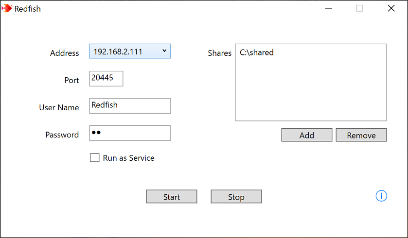

# Redfish

Redfish is a simple, flexible SMB server for Windows. Originally developed by the [Skyjos](https://www.skyjos.com) team, it is open source and available on GitHub.

Redfish provides an alternative to Windows file sharing, with a desktop interface for configuring shared folders, a user account, and a custom service port.

## Screenshot

## How it works

Redfish is written in C# and requires .NET Framework 4.8 or later. You can:

- Share folders using a standalone application.
- Run file sharing in the background as a Windows service.
- Configure shared folders, a user account, and a custom service port.

The interface is available in English, Simplified Chinese, Japanese, and German.

Redfish has been tested on Windows 10 and Windows 11.

See [Running Redfish](SERVICE.md) for service configuration and command-line options, and the [installer guide](installer/README.md) for packaging instructions.

### Default port

Windows file sharing uses port 445. To avoid conflicts, Redfish uses port 20445 by default. You can change this port in the application.

## Third-party libraries

- [SMBLibrary](https://github.com/TalAloni/SMBLibrary) — an SMB library developed by [Tal Aloni](https://github.com/TalAloni).

## Contact

For questions or suggestions, contact [support@skyjos.com](mailto:support@skyjos.com).
